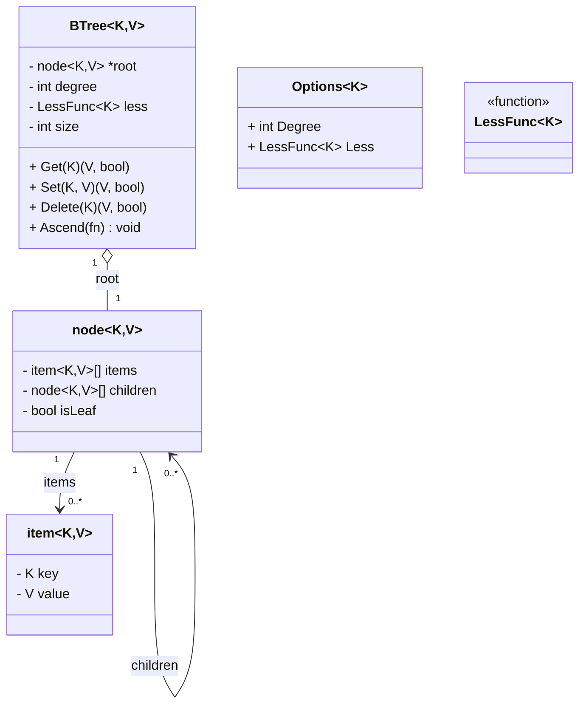

```mermaid
classDiagram
    class BTree~K,V~ {
        - node~K,V~ *root
        - int degree
        - LessFunc~K~ less
        - int size
        + Get(K) (V, bool)
        + Set(K, V) (V, bool)
        + Delete(K) (V, bool)
        + Ascend(fn) void
    }

    class node~K,V~ {
        - item~K,V~[] items
        - node~K,V~[] children
        - bool isLeaf
    }

    class item~K,V~ {
        - K key
        - V value
    }

    class Options~K~ {
        + int Degree
        + LessFunc~K~ Less
    }

    class LessFunc~K~ {
        <<function>>
    }

    BTree "1" o-- "1" node : root
    node "1" --> "0..*" item : items
    node "1" --> "0..*" node : children
```